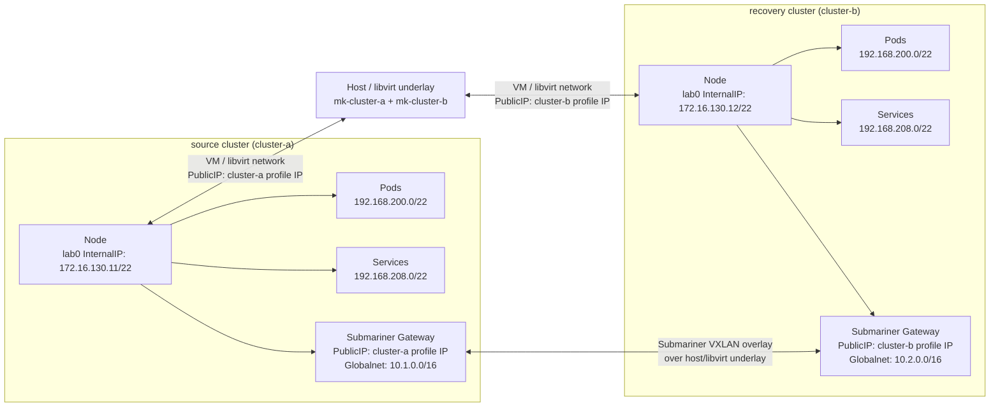
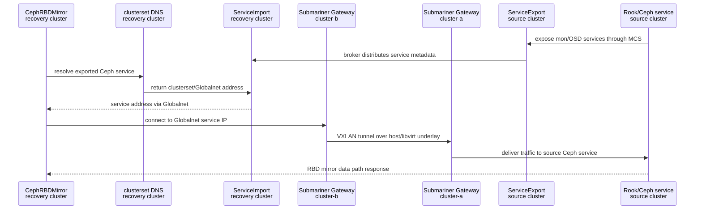

# overlapping-cidr-rbd-mirror

同一ホスト上の 2 つの Kubernetes クラスタで、Pod CIDR / Service CIDR をあえて重複させた状態のまま Submariner Globalnet を使い、Rook/Ceph の RBD mirroring を検証する実験です。

構築時に詰まりやすい点は [FAQ](./faq.md) に分けています。

## Goal

- 2 つの Minikube クラスタを同一ホスト上に作る
- 両クラスタに同じ Pod CIDR / Service CIDR を与える
- Submariner を Globalnet 有効で導入し、overlapping CIDR を扱えるようにする
- 各クラスタに Rook/Ceph を導入する
- recovery cluster (`cluster-b`) の `CephBlockPool` に source cluster (`cluster-a`) の mirroring peer を登録する
- recovery cluster (`cluster-b`) に `CephRBDMirror` daemon を起動し、pull 側のミラーリング状態を確認する
- サンプル PVC を source cluster (`cluster-a`) に作成し、少なくとも 1 つの RBD イメージを生成する

## Architecture

Submariner が扱うのは、主にクラスタ内の Pod/Service CIDR の重複です。
Broker は通信の中継点ではなく、各 cluster の Endpoint / Cluster 情報を交換する control plane です。
実際の dataplane は Submariner Gateway 同士の VXLAN tunnel で流れます。

### Network



### RBD Mirror Network Resolution



## Defaults

主要な値はリポジトリルートの [mise.toml](../mise.toml) で管理します。

| Item | Default |
| --- | --- |
| Kubernetes | `v1.33.9` |
| Minikube | `v1.38.1` |
| Minikube driver | `kvm2` |
| Container runtime | `docker` |
| Pod CIDR | `192.168.200.0/22` |
| Service CIDR | `192.168.208.0/22` |
| Node InternalIP CIDR | `172.16.128.0/22` |
| Source Globalnet CIDR | `10.1.0.0/16` |
| Recovery Globalnet CIDR | `10.2.0.0/16` |
| Submariner cable driver | `vxlan` |
| Submariner packet filter | `iptables` (`SUBMARINER_USE_NFTABLES=false`) |
| Rook | `v1.19.4` |
| Ceph | `quay.io/ceph/ceph:v19.2.3` |
| Probe BusyBox | `registry.k8s.io/e2e-test-images/busybox:1.29-4` |
| CephFS CSI | disabled |

## Prerequisites

- Linux host with KVM/libvirt available
- `mise`
- `curl`, `sed`, `base64`, `socat`, `ip`
- `minikube`, `kubectl`, `subctl` (installed by `make setup` when needed)
- `iptables` for this lab's default Submariner packet filter backend

Host/WSL/KVM specific notes are in [FAQ](./faq.md).

## Runbook

初期状態から全体を検証する場合:

```bash
cd overlapping-cidr-rbd-mirror
mise trust ..
make clean-clusters && make all
```

段階実行する場合:

```bash
cd overlapping-cidr-rbd-mirror
mise trust ..
make setup
make clean-clusters
make clusters
make submariner
make globalnet-test
make rook
make mirror
make sample
make sync
make verify
```

途中でクラスタ状態が壊れた場合:

```bash
make clean-clusters
make clusters
```

## What Each Step Does

| Target | Summary |
| --- | --- |
| `make setup` | host package / tool setup |
| `make clusters` | `cluster-a` / `cluster-b` Minikube profiles, overlapping Pod/Service CIDRs, isolated node InternalIP setup |
| `make submariner` | broker deploy, Globalnet join, gateway PublicIP annotation |
| `make globalnet-test` | ServiceExport / ServiceImport / clusterset DNS / Globalnet HTTP test |
| `make rook` | Rook operator and CephCluster deployment on both clusters |
| `make mirror` | RBD mirror peer secret registration |
| `make sample` | sample PVC and writer pod creation on source cluster |
| `make sync` | RBD mirror sync readiness check |
| `make verify` | Submariner, MCS, Rook/Ceph, and RBD mirror status checks |

## Validation Points

- `subctl show connections` で接続が見える
- `make globalnet-test` で source cluster (`cluster-a`) の exported Service が recovery cluster (`cluster-b`) に `ServiceImport` として現れ、`*.svc.clusterset.local` で通信できる
- `kubectl -n rook-ceph get cephcluster` が Ready と判断できる状態まで進む
- `kubectl -n rook-ceph get cephblockpool mirrored-pool -o jsonpath='{.status.mirroringStatus.summary}'` が取得できる
- recovery cluster (`cluster-b`) で `kubectl -n rook-ceph get cephrbdmirror rbd-mirror` が作成済みで pod が起動している

## Known Limits

- Minikube 上の Ceph は性能評価向きではありません
- Ceph は low-redundancy なので本番用の HA 構成ではありません
- 同一ホスト上の 2 profile で再現するため、実ネットワーク障害の再現度は限定的です
- PVC の自動フェイルオーバーまでは含めていません
